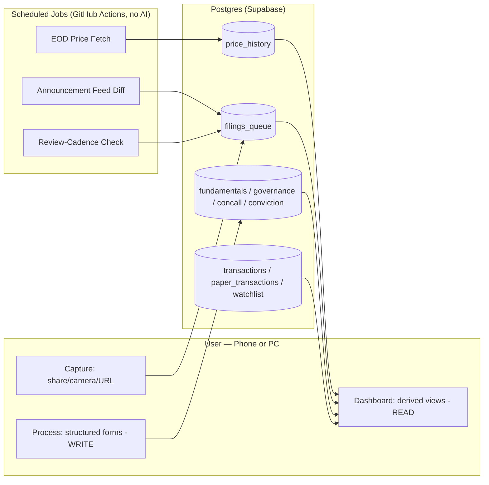

# Personal Equity Research Dashboard — Build Specification

**Companion to:** `equity-research-dashboard-requirements.md` (scope, constraints, non-negotiables)
**This document:** concrete tech stack, architecture, schema, and phased build plan.

---

## 1. Overview

A personal, AI-independent-at-runtime dashboard for tracking Indian equity holdings and conducting structured retail-accessible research (fundamentals, governance red flags, concall promise-tracking, valuation-in-context, conviction log). Built once with AI assistance (Claude Code); runs forever without any AI API calls. Single user, Android + Linux + Windows only.

---

## 2. Tech Stack Decisions

### Recommended: Option A — Supabase all-in-one
Chosen because it collapses auth, database, file storage, and scheduled functions into one managed service — minimizing code you have to write and maintain solo.

| Layer | Choice | Why |
|---|---|---|
| Frontend | React (Vite) PWA, Tailwind | Fast build, PWA-ready, Chrome/Chromium-only target (no Safari shims) |
| Database | Postgres via **Supabase** | Managed, generous free tier, auto-generated REST/client SDK |
| Auth | Supabase Auth (single user) | No custom auth code needed |
| File storage | Supabase Storage | For camera-capture attachments |
| Scheduled jobs | **GitHub Actions** (scheduled workflow) running Python scripts | Free, versioned in your repo, no separate server to maintain |
| Frontend hosting | **GitHub Pages** | HTTPS by default, PWA-friendly, zero commercial-use ToS ambiguity, collapses hosting into the same GitHub account already used for Actions + backups (see Section 14) |
| Client data layer | TanStack Query (React Query) | Enforces fetch-fresh-on-focus, prevents stale client caching |

**Option B (custom backend — Node/FastAPI + Neon Postgres + Railway)** remains available if you want more control later, but adds a server you have to run and secure yourself. Not recommended for a solo personal project unless you specifically want the practice.

---

## 3. System Architecture



No AI appears anywhere in this diagram — by design. AI was used to build this system, not to run it.

---

## 4. Data Model

### 4a. Research Framework Tables (retail-specific — see prior discussion for rationale)

**Deliberately excluded** (considered and rejected, to avoid re-litigating during build):
- *Peer comparables* — requires maintaining fundamentals for companies you don't own; highest manual burden of any candidate, and Screener.in already does it free.
- *Macro data* (repo rate, CPI, GDP) — low frequency, largely noise for individual stock decisions, and will go stale within two quarters.
- *Bulk/block deals* — high volume, low signal; would clutter the task queue enough to erode trust in it.

```sql
-- Static company reference
companies (
  isin              text PRIMARY KEY,
  symbol_nse        text,
  symbol_bse        text,
  company_name      text NOT NULL,
  sector            text,
  industry          text,
  listing_date      date,
  fiscal_year_end_month smallint DEFAULT 3,
  sector_template   text  -- e.g. 'capital_goods', 'bank', 'fmcg', 'it_services', 'pharma' — drives which
                          -- form fields show. Phase 0 watchlist (sql/seed/phase0_companies.sql) uses all
                          -- five; 'it_services' and 'pharma' are new beyond the original two examples and
                          -- need their own field set decided (e.g. IT: no order-book fields, different
                          -- margin drivers; pharma: USFDA/regulatory flags, ANDA pipeline notes) before
                          -- the fundamentals/governance forms are built.
);

-- Quarterly fundamentals
fundamentals_quarterly (
  id                bigserial PRIMARY KEY,
  isin              text REFERENCES companies,
  period_end        date NOT NULL,
  filing_type       text CHECK (filing_type IN ('standalone','consolidated')),
  revenue           numeric,
  ebitda            numeric,
  pat               numeric,
  cfo               numeric,        -- cash flow from operations: highest-signal field
  capex             numeric,
  receivable_days   numeric,
  inventory_days    numeric,
  payable_days      numeric,
  debt_total        numeric,
  equity_total       numeric,
  interest_expense  numeric,
  ebit              numeric,
  eps               numeric,
  source_url        text,
  source_page       text,
  entry_mode        text DEFAULT 'manual' CHECK (entry_mode IN ('auto','manual')),
  status            text DEFAULT 'confirmed' CHECK (status IN ('unverified','confirmed')),
  entered_at        timestamptz DEFAULT now()
);

-- Governance / red-flag tracking
governance_tracking (
  id                     bigserial PRIMARY KEY,
  isin                   text REFERENCES companies,
  as_of_date             date NOT NULL,
  promoter_holding_pct   numeric,
  promoter_pledge_pct    numeric,   -- key distress signal
  fii_holding_pct        numeric,
  dii_holding_pct        numeric,
  rpt_value              numeric,
  rpt_notes              text,
  contingent_liabilities numeric,
  auditor_name           text,
  auditor_changed_flag   boolean DEFAULT false,
  auditor_opinion        text CHECK (auditor_opinion IN ('unqualified','qualified','adverse','disclaimer')),
  cfo_cs_change_flag     boolean DEFAULT false,
  cfo_cs_change_notes    text,
  filing_delay_flag      boolean DEFAULT false,
  exchange_notice_flag   boolean DEFAULT false,
  exchange_notice_notes  text,
  source_url             text,
  entry_mode             text DEFAULT 'manual' CHECK (entry_mode IN ('auto','manual')),
  status                 text DEFAULT 'confirmed' CHECK (status IN ('unverified','confirmed')),
  entered_at             timestamptz DEFAULT now()
);

-- Concall / qualitative tracking
concall_tracking (
  id                       bigserial PRIMARY KEY,
  isin                     text REFERENCES companies,
  concall_date             date,
  guidance_given           text,
  guidance_met_flag        text CHECK (guidance_met_flag IN ('met','missed','exceeded','too_early')),
  order_book_value         numeric,   -- nullable, sector-dependent
  order_inflow_qoq         numeric,   -- nullable
  capex_guidance           text,
  capex_actual_vs_guided   text,
  management_tone_note     text,
  key_risks_flagged        text,
  source_url               text,
  entered_at               timestamptz DEFAULT now()
);

-- Corporate calendar / events (feeds daily task queue)
corporate_events (
  id           bigserial PRIMARY KEY,
  isin         text REFERENCES companies,
  event_type   text CHECK (event_type IN ('board_meeting','result_date','agm','egm',
                                            'dividend_record','buyback_record','rights_issue')),
  event_date   date,
  status       text DEFAULT 'upcoming' CHECK (status IN ('upcoming','completed','postponed')),
  notes        text,
  source_url   text
);

-- Conviction log (append-only)
conviction_log (
  id                    bigserial PRIMARY KEY,
  isin                  text REFERENCES companies,
  entry_date            date DEFAULT current_date,
  thesis_text           text,
  falsifier_text        text,
  conviction_level      text CHECK (conviction_level IN ('low','medium','high')),
  linked_price_at_entry numeric
);
```

### Staged Ingestion (reduces manual entry — see Section 8a)

`fundamentals_quarterly` and `governance_tracking` carry `entry_mode` ('auto'/'manual') and `status` ('unverified'/'confirmed'). Deterministic feed jobs insert rows with `entry_mode='auto', status='unverified'`; the dashboard's review inbox lets the user confirm (flip to `'confirmed'`) or edit in one pass instead of transcribing from scratch. Views that feed headline numbers (`v_valuation_snapshot`, etc.) should visually flag any `unverified` row rather than silently including or excluding it — the user decides, the system never hides the distinction. Manual entry via the structured form remains fully functional at all times as the fallback path.

### Supporting Tables

```sql
-- Watchlist: companies tracked but not necessarily owned.
-- Drives the announcement-feed diff job (Section 8). Distinct from holdings.
watchlist (
  isin        text PRIMARY KEY REFERENCES companies,
  added_date  date DEFAULT current_date,
  active      boolean DEFAULT true,
  notes       text
);

-- Benchmark index EOD values. Populated by the same bhavcopy job as price_history —
-- no manual entry. Without this, absolute portfolio returns are uninterpretable.
index_history (
  index_name  text,      -- 'NIFTY 50', 'NIFTY 500', relevant sector indices
  date        date,
  close       numeric,
  PRIMARY KEY (index_name, date)
);

-- Credit rating actions. Free rationales from CRISIL / ICRA / CARE / India Ratings.
-- Few events per company per year; often earlier and blunter than equity narrative.
rating_actions (
  id                bigserial PRIMARY KEY,
  isin              text REFERENCES companies,
  agency            text CHECK (agency IN ('CRISIL','ICRA','CARE','India Ratings','Other')),
  instrument        text,          -- e.g. 'long-term bank facilities'
  rating            text,
  previous_rating   text,
  outlook           text CHECK (outlook IN ('positive','stable','negative','developing','watch')),
  action_date       date NOT NULL,
  rationale_url     text,
  notes             text,
  entered_at        timestamptz DEFAULT now(),
  UNIQUE (isin, agency, instrument, action_date)
);

-- Insider / promoter dealings (SAST + PIT disclosures).
-- Arrives via the announcement feed job — mostly automated, little manual burden.
insider_transactions (
  id               bigserial PRIMARY KEY,
  isin             text REFERENCES companies,
  person_name      text,
  relationship     text CHECK (relationship IN ('promoter','promoter_group','kmp','director','other')),
  txn_type         text CHECK (txn_type IN ('buy','sell','pledge','pledge_release','encumbrance')),
  quantity         numeric,
  value            numeric,
  txn_date         date,
  disclosure_date  date,
  source_url       text,
  entered_at       timestamptz DEFAULT now()
);

-- Cash available for deployment. Makes the dashboard actionable, not just informative.
cash_ledger (
  id          bigserial PRIMARY KEY,
  entry_date  date NOT NULL,
  amount      numeric NOT NULL,   -- positive = inflow, negative = deployed/withdrawn
  entry_type  text CHECK (entry_type IN ('deposit','withdrawal','dividend','buy','sell')),
  notes       text,
  entered_at  timestamptz DEFAULT now()
);

-- REAL transactions — the base table. Lot-level, required for FIFO tax computation.
-- Never store an average price: Indian LTCG/STCG applies the >12-month test per lot,
-- and grandfathering (31 Jan 2018 FMV) needs the original lot date.
transactions (
  id            bigserial PRIMARY KEY,
  isin          text REFERENCES companies,
  txn_type      text NOT NULL CHECK (txn_type IN ('buy','sell')),
  txn_date      date NOT NULL,
  quantity      numeric NOT NULL CHECK (quantity > 0),
  price         numeric NOT NULL,
  charges       numeric DEFAULT 0,   -- brokerage + STT + stamp duty + GST
  notes         text,
  entered_at    timestamptz DEFAULT now(),
  updated_at    timestamptz DEFAULT now()
);

-- PAPER transactions — identical shape, strictly separate table.
-- Gives paper positions a proper exit/close path.
paper_transactions (
  id            bigserial PRIMARY KEY,
  isin          text REFERENCES companies,
  txn_type      text NOT NULL CHECK (txn_type IN ('buy','sell')),
  txn_date      date NOT NULL,
  quantity      numeric NOT NULL CHECK (quantity > 0),
  price         numeric NOT NULL,
  strategy_tag  text,   -- e.g. 'sip_test', 'what_if_2023'
  notes         text,
  entered_at    timestamptz DEFAULT now(),
  updated_at    timestamptz DEFAULT now()
);

-- Dividends actually received (cash), tracked separately from the event calendar.
-- Without this, long-run total return is understated.
dividends_received (
  id             bigserial PRIMARY KEY,
  isin           text REFERENCES companies,
  pay_date       date NOT NULL,
  amount_per_share numeric,
  quantity_held  numeric,
  total_amount   numeric NOT NULL,
  tds_deducted   numeric DEFAULT 0,
  notes          text,
  entered_at     timestamptz DEFAULT now()
);

-- EOD price history (raw, as reported — never mutated)
price_history (
  isin          text REFERENCES companies,
  date          date,
  open          numeric, high numeric, low numeric, close numeric,
  volume        bigint,
  PRIMARY KEY (isin, date)
);

-- Corporate actions — used for QUERY-TIME adjustment only.
-- No applied_flag: raw price_history is never rewritten (see note below).
corporate_actions (
  id           bigserial PRIMARY KEY,
  isin         text REFERENCES companies,
  action_type  text CHECK (action_type IN ('split','bonus','rights')),
  ratio_from   numeric NOT NULL,   -- e.g. split 1:5 -> ratio_from 1, ratio_to 5
  ratio_to     numeric NOT NULL,   -- numeric, not text: must be computable
  ex_date      date NOT NULL,
  notes        text,
  UNIQUE (isin, action_type, ex_date)
);

-- Capture queue (mobile capture lands here first)
filings_queue (
  id            bigserial PRIMARY KEY,
  isin          text REFERENCES companies,  -- nullable until tagged
  document_type text CHECK (document_type IN ('quarterly_result','annual_report',
                                                'rating_action','shareholding_pattern',
                                                'concall','other','review_due')),
  source_url    text,
  note          text,
  status        text DEFAULT 'pending' CHECK (status IN ('pending','processed')),
  captured_at   timestamptz DEFAULT now(),
  processed_at  timestamptz
);

attachments (
  id               bigserial PRIMARY KEY,
  filings_queue_id bigint REFERENCES filings_queue,
  file_path        text,   -- Supabase Storage path
  uploaded_at      timestamptz DEFAULT now()
);
```

### Constraints & Triggers (prevent duplicate-entry bugs)

```sql
-- Stop the same period being entered twice
ALTER TABLE fundamentals_quarterly
  ADD CONSTRAINT uq_fundamentals UNIQUE (isin, period_end, filing_type);

ALTER TABLE governance_tracking
  ADD CONSTRAINT uq_governance UNIQUE (isin, as_of_date);

ALTER TABLE concall_tracking
  ADD CONSTRAINT uq_concall UNIQUE (isin, concall_date);

-- updated_at maintenance (needed by the optimistic-concurrency check in Section 6)
ALTER TABLE fundamentals_quarterly ADD COLUMN updated_at timestamptz DEFAULT now();
ALTER TABLE governance_tracking   ADD COLUMN updated_at timestamptz DEFAULT now();
ALTER TABLE concall_tracking      ADD COLUMN updated_at timestamptz DEFAULT now();

CREATE OR REPLACE FUNCTION set_updated_at() RETURNS trigger AS $$
BEGIN NEW.updated_at = now(); RETURN NEW; END;
$$ LANGUAGE plpgsql;

-- Apply to each table carrying updated_at
CREATE TRIGGER trg_fundamentals_updated BEFORE UPDATE ON fundamentals_quarterly
  FOR EACH ROW EXECUTE FUNCTION set_updated_at();
-- (repeat for governance_tracking, concall_tracking, transactions, paper_transactions)
```

### Correction History (append-only requirement)

The requirements doc mandates that historical values are appended, not overwritten. A plain `UPDATE` on a past quarter would violate that. Simplest resolution that doesn't complicate every query:

```sql
-- Audit trail: old row snapshotted before any update
research_edit_history (
  id           bigserial PRIMARY KEY,
  table_name   text NOT NULL,
  row_id       bigint NOT NULL,
  old_values   jsonb NOT NULL,
  changed_at   timestamptz DEFAULT now(),
  change_note  text
);
```
Live tables stay current and easy to query; the full history of corrections is preserved in one place. Populate via a BEFORE UPDATE trigger on each research table.

### Computed Views (not stored redundantly)

```sql
-- Split/bonus-adjusted prices, computed at query time. Raw history is never rewritten.
CREATE VIEW v_price_adjusted AS
SELECT ph.isin, ph.date, ph.close AS close_raw,
       ph.close / COALESCE((
         SELECT exp(sum(ln(ca.ratio_to / ca.ratio_from)))
         FROM corporate_actions ca
         WHERE ca.isin = ph.isin AND ca.ex_date > ph.date
       ), 1) AS close_adjusted
FROM price_history ph;

-- Trailing-twelve-month EPS: sum of last 4 quarters.
-- NOTE: P/E must use TTM EPS, never a single quarter's EPS.
CREATE VIEW v_ttm_eps AS
SELECT isin, filing_type, max(period_end) AS as_of,
       sum(eps) AS eps_ttm
FROM (
  SELECT *, row_number() OVER (PARTITION BY isin, filing_type ORDER BY period_end DESC) AS rn
  FROM fundamentals_quarterly
) q
WHERE rn <= 4
GROUP BY isin, filing_type
HAVING count(*) = 4;   -- only valid with a full 4 quarters

-- Valuation snapshot with 5-year P/E band for context
CREATE VIEW v_valuation_snapshot AS
WITH latest_price AS (
  SELECT DISTINCT ON (isin) isin, close, date
  FROM price_history ORDER BY isin, date DESC
),
pe_history AS (
  SELECT ph.isin, ph.date, ph.close / NULLIF(t.eps_ttm, 0) AS pe
  FROM price_history ph
  JOIN v_ttm_eps t ON t.isin = ph.isin
  WHERE ph.date >= current_date - interval '5 years'
)
SELECT c.isin, c.company_name,
       p.close AS price_current,
       p.close / NULLIF(t.eps_ttm, 0) AS pe_current,
       avg(h.pe)    AS pe_5yr_avg,
       min(h.pe)    AS pe_5yr_min,
       max(h.pe)    AS pe_5yr_max,
       percentile_cont(0.5) WITHIN GROUP (ORDER BY h.pe) AS pe_5yr_median
FROM companies c
JOIN latest_price p ON p.isin = c.isin
LEFT JOIN v_ttm_eps t ON t.isin = c.isin
LEFT JOIN pe_history h ON h.isin = c.isin
GROUP BY c.isin, c.company_name, p.close, t.eps_ttm;

-- Current REAL holdings, derived from transactions (never stored)
CREATE VIEW v_holdings AS
SELECT t.isin,
       sum(CASE WHEN txn_type='buy' THEN quantity ELSE -quantity END) AS quantity,
       sum(CASE WHEN txn_type='buy' THEN quantity*price + charges ELSE 0 END)
         / NULLIF(sum(CASE WHEN txn_type='buy' THEN quantity ELSE 0 END),0) AS avg_cost
FROM transactions t
GROUP BY t.isin
HAVING sum(CASE WHEN txn_type='buy' THEN quantity ELSE -quantity END) > 0;

CREATE VIEW v_portfolio_summary AS
SELECT h.isin, h.quantity, h.avg_cost, p.close AS current_price,
       h.quantity * p.close AS current_value,
       h.quantity * (p.close - h.avg_cost) AS unrealized_pnl
FROM v_holdings h
JOIN LATERAL (
  SELECT close FROM price_history ph WHERE ph.isin = h.isin ORDER BY date DESC LIMIT 1
) p ON true;

-- Open PAPER positions — identical logic, separate source table, never joined into the above
CREATE VIEW v_paper_holdings AS
SELECT pt.isin, pt.strategy_tag,
       sum(CASE WHEN txn_type='buy' THEN quantity ELSE -quantity END) AS quantity,
       sum(CASE WHEN txn_type='buy' THEN quantity*price ELSE 0 END)
         / NULLIF(sum(CASE WHEN txn_type='buy' THEN quantity ELSE 0 END),0) AS avg_cost
FROM paper_transactions pt
GROUP BY pt.isin, pt.strategy_tag
HAVING sum(CASE WHEN txn_type='buy' THEN quantity ELSE -quantity END) > 0;

-- FIFO tax lots: PLACEHOLDER ONLY — lists open buy lots but does NOT yet consume
-- them against sells. Every historical buy currently shows as open forever; this is
-- NOT a correct tax basis. Phase 3 must replace this with a real FIFO consumption
-- routine (running-balance per isin, ordered by txn_date, decrementing buy lots as
-- sells are matched) plus a grandfathering column (31-Jan-2018 FMV) for LTCG. Do not
-- wire this view into any tax-facing UI before that rewrite.
CREATE VIEW v_tax_lots AS
SELECT isin, txn_date AS lot_date, quantity, price,
       CASE WHEN txn_date <= current_date - interval '12 months'
            THEN 'long_term' ELSE 'short_term' END AS holding_class,
       (current_date - txn_date) AS days_held
FROM transactions
WHERE txn_type = 'buy'
ORDER BY isin, txn_date;   -- FIFO consumption order — NOT YET IMPLEMENTED, see note above

-- Benchmark comparison: portfolio value vs index, rebased to 100 at a chosen start.
-- Absolute returns are uninterpretable without this.
--
-- NOTE (fixed from an earlier draft): must use holdings AS OF EACH DATE, not
-- v_holdings' CURRENT quantities applied across all history — the latter silently
-- backtests today's portfolio instead of computing your actual realised return.
-- daily_holdings reconstructs quantity-per-isin-per-date from the running sum of
-- transactions up to that date.
CREATE VIEW v_benchmark_comparison AS
WITH dates AS (
  SELECT DISTINCT date FROM price_history
),
running_qty AS (
  SELECT isin, txn_date AS date,
         sum(CASE WHEN txn_type='buy' THEN quantity ELSE -quantity END)
           OVER (PARTITION BY isin ORDER BY txn_date
                 ROWS BETWEEN UNBOUNDED PRECEDING AND CURRENT ROW) AS qty_after
  FROM transactions
),
daily_holdings AS (
  SELECT d.date, r.isin,
         (SELECT rq.qty_after FROM running_qty rq
          WHERE rq.isin = r.isin AND rq.date <= d.date
          ORDER BY rq.date DESC LIMIT 1) AS quantity
  FROM dates d
  CROSS JOIN (SELECT DISTINCT isin FROM transactions) r
),
pf AS (
  SELECT dh.date, sum(dh.quantity * ph.close) AS portfolio_value
  FROM daily_holdings dh
  JOIN price_history ph ON ph.isin = dh.isin AND ph.date = dh.date
  WHERE dh.quantity > 0
  GROUP BY dh.date
),
idx AS (
  SELECT date, close FROM index_history WHERE index_name = 'NIFTY 50'
)
SELECT pf.date,
       pf.portfolio_value,
       idx.close AS index_close,
       100 * pf.portfolio_value / first_value(pf.portfolio_value) OVER (ORDER BY pf.date)
         AS portfolio_rebased,
       100 * idx.close / first_value(idx.close) OVER (ORDER BY pf.date)
         AS index_rebased
FROM pf JOIN idx ON idx.date = pf.date
ORDER BY pf.date;
-- Correlated subquery in daily_holdings is fine at MVP data volume (5 companies,
-- a few years of trading days); revisit with a proper window/gaps-and-islands
-- approach if it becomes a query-time bottleneck.

-- Concentration & sector exposure — derived, no new data required.
-- Concentration risk is the most likely real danger to a retail equity portfolio.
CREATE VIEW v_concentration AS
SELECT c.sector,
       s.isin, c.company_name,
       s.current_value,
       100 * s.current_value / sum(s.current_value) OVER () AS pct_of_portfolio,
       100 * sum(s.current_value) OVER (PARTITION BY c.sector)
           / sum(s.current_value) OVER () AS pct_of_sector
FROM v_portfolio_summary s
JOIN companies c ON c.isin = s.isin;

-- Deployable cash
CREATE VIEW v_cash_position AS
SELECT sum(amount) AS cash_available FROM cash_ledger;
```

**Note on corporate actions:** `price_history` stores raw prices exactly as reported and is **never mutated**. All split/bonus adjustment happens at query time via `v_price_adjusted`. Charts and multi-year comparisons must read from the adjusted view; raw prices are for reconciling against contract notes.

---

## 5. Mobile Capture Flow

- **Web Share Target API** (Android/Chrome) — sharing a URL from the NSE/BSE announcement page or any browser tab inserts directly into `filings_queue` via the Supabase client SDK.
- **Camera capture** — photo uploads to Supabase Storage; row created in `attachments` linked to a new `filings_queue` entry.
- **Voice-to-text note** — native OS keyboard feature on the note field; no custom build needed.
- **Company tagging** — autocomplete search against `companies` by ISIN/symbol/name, optional at capture time (can stay untagged until processing).

---

## 6. Sync & Consistency

- Single Postgres instance is the only source of truth — phone and PC are both just clients.
- **TanStack Query** with short/no stale-time on dashboard queries — refetch on mount and on window/tab focus.
- **Background Sync API** (Android/Chrome) + IndexedDB local queue — offline captures sync once connectivity returns.
- Every table has `entered_at`/`updated_at`; simple optimistic-concurrency check on edit (compare timestamp before save, warn on conflict — low-probability for single user, cheap insurance).
- Shared Supabase Auth session — same login, any device.

---

## 7. Security & Backups

- Supabase Auth, single user account. **Row-Level Security enabled on every table**, with a blanket policy granting access to the `authenticated` role only — no `user_id` column needed anywhere, since there is exactly one user. (Per-row ownership scoping is unnecessary complexity for a single-user tool; do *not* add `user_id` columns.)
  ```sql
  ALTER TABLE <each_table> ENABLE ROW LEVEL SECURITY;
  CREATE POLICY auth_only ON <each_table>
    FOR ALL TO authenticated USING (true) WITH CHECK (true);
  ```
  RLS must be enabled on **every** table — an un-policied table in Supabase is publicly readable via the auto-generated API.
- HTTPS by default via Vercel + Supabase.
- **Daily backup:** scheduled GitHub Action running `pg_dump`, **gzipped**, committed into a second private GitHub repo dedicated to backups (free, versioned, no cloud storage bucket needed). Set up in Phase 0, not later.
- **Backup pruning:** git retains every committed version forever, so an uncompressed daily dump grows the repo without bound over a multi-year horizon. Keep the last 30 daily dumps, then one per month thereafter; the job deletes superseded files as part of the same commit.
- CSV/JSON export: a simple script or dashboard button hitting Supabase's REST endpoints — no lock-in.

---

## 8. Automated Deterministic Jobs (no AI)

All run as **GitHub Actions scheduled workflows**, each a small Python script connecting directly to Postgres.

**Cron must be timezone-pinned.** Indian markets close 15:30 IST; GitHub Actions cron defaults to UTC. Use the `timezone:` field:

```yaml
on:
  schedule:
    - cron: '30 18 * * 1-5'
      timezone: 'Asia/Kolkata'
  workflow_dispatch:        # always include, for manual testing
```

### Jobs

0. **CI-runner endpoint spike** — `.github/workflows/nse-endpoint-spike.yml`, manual-trigger diagnostic. **Run 2026-08-15: all endpoints (bhavcopy + every `/api/*` used below) returned 200 from a GitHub Actions runner** — see Section 8a. Jobs 1–2b below can all live in CI. Keep the workflow in the repo and re-run it if NSE ever starts blocking CI IPs; don't delete it as "done," it's the early-warning check for a WAF policy change.
1. **EOD price fetch** — post-market-close on trading days. Upserts into `price_history` from the UDiFF bhavcopy **and into `index_history` from the separate all-indices close file** (`ind_close_all_{ddmmyyyy}.csv`). Correction to an earlier draft of this spec: index values do **not** come from the bhavcopy — every bhavcopy row is `FinInstrmTp = STK` and no index appears in it. Both files sit on the same `nsearchives` host, so this is still one job with two downloads, no manual entry. The bhavcopy carries ISIN directly, so match on that, never on symbol.
2. **Announcement feed diff** — fetches the NSE/BSE corporate announcement feed, filters to ISINs in `watchlist`, inserts matches into `filings_queue` with `document_type` set where inferable. SAST/PIT insider disclosures and rating-agency announcements arrive through this same feed — route them to `insider_transactions` and `rating_actions` respectively.
2a. **XBRL fundamentals ingestion** — poll `/api/integrated-filing-results` (bulk date-range form with a ~3-day lookback), filter to `type == "Integrated Filing- Financials"`, download each `xbrl` URL, parse, and upsert into `fundamentals_quarterly` as `entry_mode='auto', status='unverified'`. CFO and capex are not tagged in quarterly filings — leave null on auto rows and fill on confirm.

    **Parser requirements — verified 2026-08-15, these are not optional details:**
    - **Namespace is `in-capmkt`** (`http://www.sebi.gov.in/xbrl/2026-01-31/in-capmkt`), not the pre-2025 `in-bse-fin`. The URI is version-dated, so **match on local-name and ignore the namespace URI**, or the parser breaks at the next SEBI taxonomy revision.
    - **Two different schemas, identified by filename:**
      - `INTEGRATED_FILING_INDAS_*` — normal companies: `RevenueFromOperations`, `ProfitBeforeTax`, `ProfitLossForPeriod`, `FinanceCosts`, `DepreciationDepletionAndAmortisationExpense`. EPS was renamed — use `BasicEarningsLossPerShareFromContinuingAndDiscontinuedOperations`.
      - `INTEGRATED_FILING_BANKING_*` — banks/NBFCs: a **completely different vocabulary** (`InterestEarned`, `InterestExpended`, `Income`, `OperatingProfitBeforeProvisionAndContingencies`, `ProfitLossFromOrdinaryActivitiesBeforeTax`, `BasicEarningsPerShareAfterExtraordinaryItems`). There is no `RevenueFromOperations` at all. **HDFC Bank is this case**, so the MVP watchlist exercises both schemas from day one — good, but it means the bank mapping cannot be deferred.
    - **`LevelOfRounding` says `Crores` but values are in absolute rupees.** Do not apply the rounding multiplier (HDFC Bank `Income` = 1331103600000 = ₹1,33,110 cr). This is exactly the kind of silent factor-of-10⁷ error that would poison every derived view.
    - `contextRef` semantics unchanged: `OneD` = the quarter, `FourD` = year-to-date, `OneI` = instant. Q1 filings have no `FourD`. **Ignore any context carrying an `explicitMember`** — those are segment breakdowns, not headline numbers.
    - Dedupe on (isin, period_end, consolidated) keeping the latest `broadcast_Date`; restatements arrive as new rows with `revised_Date` populated, which `ON CONFLICT DO UPDATE` handles naturally.
    - The XBRL carries the **current** ISIN (verified `INE040A01034` for HDFC Bank), unlike the legacy filings API — so match on the ISIN inside the file, not on the one in the legacy feed.
    - Ignore the `pdf_attach` field; it is literally `.../corporate/null` on these rows.

    **Backfill:** the two endpoints tile with no gap — legacy `/api/corporates-financial-results` runs through 23-Jan-2025 (Q3 FY25, `in-bse-fin` tags), and `/api/integrated-filing-results` starts 17-Apr-2025 (Q4 FY25, `in-capmkt`). Keep both parsers if historical fundamentals are wanted.

    **Bonus, not yet exploited:** the same endpoint also returns `type == "Integrated Filing- Governance"` XBRL (~200KB) containing board composition, committee membership, meeting dates and DINs. That is board-governance data rather than the pledge/RPT/auditor fields `governance_tracking` wants, so it does not replace the annual manual pass — but it is free structured data if board-level tracking is ever added. Untested endpoints in the same JS bundle: `/api/annual-reports-xbrl` and `/api/XBRL-announcements`.
2b. **Shareholding pattern ingestion** — poll `corporate-share-holdings-master` per watchlist ISIN each quarter; upsert promoter/public/FII/DII percentages into `governance_tracking` as `entry_mode='auto', status='unverified'`. RPT, auditor, and CFO/CS-change fields stay null on auto rows — filled once a year during the manual annual-report pass.
3. **Review-cadence check** — flags any ISIN whose latest `conviction_log` entry is older than 90 days; inserts a `review_due` row into `filings_queue`.
4. **Nightly backup** — `pg_dump`, gzipped, committed to the private backup repo (see Section 7).
5. **Heartbeat** — commits a trivial timestamp file to the repo daily, preventing GitHub's 60-day inactivity auto-disable (see Section 13).

### 8a. Verified NSE Endpoints (live-checked 2026-08-15, residential IP)

The manual-entry-reduction plan depends on these; re-verify before relying on them if much time has passed, per CLAUDE.md's "verify at build time" rule.

**Freshness audited 2026-08-15 — status codes are not enough.** Every endpoint below was checked for the newest date *inside the payload*, not just HTTP 200. One endpoint returns 200 with a 100KB body while being 19 months stale; that is exactly the failure this table now guards against. Re-audit freshness, not just reachability, whenever these are revisited.

| Feed | Endpoint | Feeds | Freshness (2026-08-15) |
|---|---|---|---|
| UDiFF bhavcopy | `nsearchives.nseindia.com/content/cm/BhavCopy_NSE_CM_0_0_0_{yyyymmdd}_F_0000.csv.zip` | `price_history` | ✅ current (T-1). Contains **ISIN directly** (col 7) — no symbol→ISIN mapping needed. All rows are `STK`; **contains NO index data** |
| **All-indices close** | `nsearchives.nseindia.com/content/indices/ind_close_all_{ddmmyyyy}.csv` | `index_history` | ✅ current. 164 indices with OHLC + index P/E, P/B, div yield. NIFTY 50 close 24395.85 on 13-08-2026 |
| **Integrated filing results** ⭐ | `www.nseindia.com/api/integrated-filing-results?index=equities&symbol=X` — or bulk: `?index=equities&from_date=DD-MM-YYYY&to_date=DD-MM-YYYY&page=1&size=100` | `fundamentals_quarterly` (auto) — **the current XBRL source** | ✅ current — HDFC Bank Q1 FY27 filed 18-Jul-2026, with `xbrl` (XML) and `ixbrl` (HTML) links. Returns `{data, totalCount}` |
| Financial results index (legacy) | `www.nseindia.com/api/corporates-financial-results?index=equities&symbol=X&period=Quarterly` | pre-2025 backfill only | ⚠️ **FROZEN AT JAN 2025** — still returns 200 with a full payload. Useful only for historical backfill; never for current data |
| XBRL result file | `nsearchives.nseindia.com/corporate/xbrl/*.xml` | parsed by the two jobs above | ✅ current files parse cleanly (verified HDFC Bank Q1 FY27) |
| Shareholding pattern | `www.nseindia.com/api/corporate-share-holdings-master?index=equities&symbol=X` | `governance_tracking` (auto, ownership fields) | ✅ current — period 30-Jun-2026, broadcast 03-Jul-2026 |
| Corporate actions | `www.nseindia.com/api/corporates-corporateActions?index=equities&symbol=X` | `corporate_actions`, dividend pre-fill | ✅ current — ex-date 19-Jun-2026 |
| Event calendar | `www.nseindia.com/api/event-calendar?index=equities&symbol=X` | `corporate_events` | ✅ current — 2026 events present |
| Announcements | `www.nseindia.com/api/corporate-announcements?index=equities&symbol=X` | `filings_queue` | ✅ current — newest 14-Aug-2026. Quarterly results now arrive here as `desc = "Outcome of Board Meeting"` with **PDF** attachments and no XBRL link |

**⚠️ Never source ISINs from the filings or corporate-actions APIs** — they record the ISIN as of filing time and go stale when a company's ISIN changes. Use the bhavcopy as the authority. Confirmed drift: HDFC Bank `INE040A01018` → **`INE040A01034`**, Sun Pharma `INE044A01028` → **`INE044A01036`**. ISINs are not immutable; see the note in `sql/seed/phase0_companies.sql`.

`www.nseindia.com/` itself 403'd even though its `/api/*` endpoints and the `nsearchives` archive subdomain answered — the archive host is the more permissive path.

**Confirmed from a GitHub Actions runner (2026-08-15, Job 0 result):** bhavcopy and all `/api/*` endpoints above returned 200 from CI — only the bare homepage 403'd, and nothing depends on it. **All jobs 1/2/2a/2b run in GitHub Actions; no home-PC fallback is needed.** If NSE's WAF policy changes later and CI starts getting blocked, re-run `.github/workflows/nse-endpoint-spike.yml` to confirm before assuming — don't guess from a stale result.

**Staged ingestion / review inbox:** every job in this section writes `entry_mode='auto', status='unverified'` rows (per the constraint added to `fundamentals_quarterly` and `governance_tracking`). The dashboard needs a review-inbox view listing unverified rows across both tables; confirming is a single tap that flips `status`, editing is a normal form pre-filled with the ingested values. This is the mechanism that turns "transcribe 15 numbers" into "glance and confirm" — see CLAUDE.md's manual-entry-is-fallback rule.

### ⚠️ NSE access is the most fragile component in this system

NSE is actively hostile to programmatic access — cookie handshakes, rate limiting, and frequent 403s from datacenter IPs. **GitHub Actions runners are datacenter IPs.** Jobs 1 and 2 together constitute the entire "tell me what to do today" feature, so their failure is silent and total.

Required mitigations, built in from Phase 1:

- **Prefer official bhavcopy file downloads over page/API scraping.** Static archive files are far more stable than the site's internal JSON endpoints. Note that NSE has moved to the newer **UDiFF** bhavcopy format — confirm the current URL pattern and format at build time.
- **Retry with exponential backoff**, and a proper cookie/session handshake (`Referer` + `User-Agent` headers) if any endpoint requires it.
- **Failure alerting is mandatory** — GitHub does **not** notify you when a scheduled workflow fails. Without alerting, the daily feed can be dead for weeks unnoticed. Cheapest reliable option: on job failure, write a row into a `job_failures` table; the dashboard displays a persistent banner if any row is newer than 24h. No email service or paid dependency needed.
- **Staleness indicator on the dashboard** — always show "prices as of {max(price_history.date)}". If that date is stale, you see it immediately rather than acting on old data.
- **Fallback (currently dormant — CI access confirmed working, see Section 8a):** if NSE ever starts blocking CI runners, a free-tier broker API (Dhan/Fyers/Upstox) is the fallback EOD **price** source — the key should still be registered up front per Section 14, as cheap insurance even though it's not load-bearing today. Note this fallback covers prices only: brokers do not carry XBRL, shareholding-pattern, or announcement data, so if `www.nseindia.com/api/*` ever becomes CI-blocked, the fix for jobs 2/2a/2b is running them from the user's own PC on a schedule, not swapping data source.

```sql
job_failures (
  id          bigserial PRIMARY KEY,
  job_name    text NOT NULL,
  error_text  text,
  failed_at   timestamptz DEFAULT now()
);
```

---

## 9. Manual Research Entry Workflow

- Form template selected by document type **and** `companies.sector_template` (e.g., order-book fields hidden for a bank or FMCG company).
- Previous period's values shown as placeholders — editing deltas, not retyping from zero. For staged (`entry_mode='auto'`) rows, the ingested values themselves are the pre-fill, not the prior period's.
- `source_url` (+ `source_page` where applicable) required at form level before submit is allowed.
- Submit → writes to the relevant research table → marks originating `filings_queue` row `processed` (or flips `status` to `'confirmed'` for a staged row).
- **`concall_tracking` trimmed for sustainability**: the form surfaces `guidance_given`, `guidance_met_flag`, and one free-text tone/risk note as the core 3 fields; the remaining schema columns stay available but optional, not required to submit. The goal is ~2 minutes of entry after a call the user was reading/listening to anyway, not a full transcript.
- **`transactions` populated by broker tradebook CSV import**, not per-trade typing: a deterministic importer maps the broker's export (e.g. Zerodha Console tradebook) to `transactions` columns, matching by ISIN. Manual single-row entry remains available for the rare off-CSV trade.

---

## 10. Simulation / Paper Trading Module

- `paper_transactions` — fully separate table and UI section from real `transactions`. Buy *and* sell events, so paper positions can be properly closed and realised P&L computed.
- V1: paper position tracking via `v_paper_holdings` + basic what-if math against stored `price_history` — pure SQL/view computation, no live market connection.
- Phase 3: SIP-vs-lump-sum comparison; **LTCG/STCG tax simulation built on `v_tax_lots`** (FIFO consumption, >12-month test per lot). This is why real holdings are transaction-based rather than averaged — an average cost basis makes lot-level tax computation impossible.

---

## 11. Build Phases

| Phase | Scope |
|---|---|
| **0 — MVP** | `companies`, `watchlist`, `transactions` (+ tradebook CSV importer), `cash_ledger`, `price_history`, **`index_history`**, `fundamentals_quarterly`, `governance_tracking`, `conviction_log`, plus `entry_mode`/`status` columns, unique constraints, and `updated_at` triggers. Dashboard: `v_portfolio_summary`, **`v_concentration`**, **`v_benchmark_comparison`** (holdings-as-of-date version), holdings table, conviction log. 5 companies. PC-only acceptable. **Backup job set up now.** |
| **1 — Automation** | Job 0 (CI-runner endpoint spike) run first. Then: price + index fetch, announcement diff, **XBRL fundamentals ingestion (2a), shareholding-pattern ingestion (2b)** — this is the phase's centerpiece, since it's what removes most of the manual-entry burden — review-cadence, heartbeat, backup. `filings_queue`, `corporate_events`, `rating_actions`, `insider_transactions`, `job_failures` in use. Review-inbox UI for unverified staged rows. Failure banner + price-staleness indicator on dashboard. |
| **2 — Mobile** | Gated on Phase 1's ingestion actually working reliably for the 5 MVP companies over real quarters — if auto-ingestion holds up, there's less left to capture manually in the first place, which changes how much mobile-capture UI is worth building. PWA installable on Android, Web Share Target capture, camera capture (with client-side image compression), offline queue via Background Sync, push notifications for hard triggers. |
| **3 — Simulation & Polish** | `paper_transactions`, **`v_tax_lots` rewritten as real FIFO consumption + grandfathering column** (see note on the current placeholder view), backtests, `v_valuation_snapshot` 5-yr bands, `dividends_received` (pre-filled from corporate-actions), CSV/JSON export, `v_price_adjusted` verified against a known split. |

---

## 12. Cost Estimate

| Item | Cost |
|---|---|
| Supabase (DB + Auth + Storage + free-tier compute) | $0 |
| GitHub Pages (frontend hosting) | $0 |
| GitHub Actions (scheduled jobs) | $0 |
| GitHub private repo (backups) | $0 |
| Domain name | **Skip it** — use the free Vercel subdomain |
| AI at runtime | $0 — none, by design |

**Total: $0/month, indefinitely — not an estimate, a guarantee (see Section 13).**

---

## 13. Zero-Cost Guarantees

### The master rule
**Never add a payment method to Supabase, Vercel, or GitHub.** None of these free tiers auto-bill on overage — hitting a limit degrades functionality (read-only DB, blocked uploads, paused deployment) rather than charging a card. With no card on file anywhere, this system is architecturally incapable of costing money, not just unlikely to.

### Free-tier limits, and how this project sits inside them

| Service | Free limit | Fit |
|---|---|---|
| Supabase | 500MB database, 1GB file storage, 5GB egress, 500,000 Edge Function calls/month | Numeric data (prices, fundamentals) stays a few MB even after years — comfortable margin |
| GitHub Pages | 100GB bandwidth/month, 1GB site size, unlimited builds via Actions minutes | Comfortable margin — a small research dashboard is nowhere near either cap; no commercial-use clause to track at all |
| GitHub Actions | 2,000 free minutes/month on a private repo | Three daily jobs at ~1–3 min each ≈ 100–300 min/month — large headroom |

### Three traps to design around (not just monitor)

1. **Supabase's 7-day inactivity pause — self-solving.** The daily automated price-fetch job (Section 8) writes to the DB every day, which keeps the project warm automatically. No separate keep-alive workaround needed.

2. **GitHub's 60-day repo-inactivity auto-disable — needs a small fix.** Scheduled workflows silently stop firing if the repository sees no activity for 60 days. Since this project may go untouched for long stretches once built, add a **heartbeat step**: one daily job commits a trivial timestamp file back to the repo. Zero cost, permanently closes this gap.

3. **Storage growth from mobile photo capture is the resource to actively manage** — not database size. Numeric research data is negligible against the 500MB cap; camera-captured attachments are the one thing that grows unpredictably against the 1GB storage cap. Mitigations:
   - Compress/downscale images client-side before upload (a few lines in the capture flow)
   - Periodically export and delete attachments for fully processed `filings_queue` items

### Backups without a paid bucket
Nightly `pg_dump` output commits into a **second private GitHub repo** dedicated to backups — free, versioned, no cloud storage service required (see updated Section 7).

---

## 14. Decisions

Settled (2026-08-15):
- **Option A (Supabase all-in-one).**
- **GitHub Actions** for scheduled jobs.
- **`filing_type` convention: consolidated** where available, falling back to standalone only when a company reports no consolidated figures.
- **EOD price source:** register a free-tier broker API key (Dhan/Fyers/Upstox) **up front**, not only after NSE fails from CI — filings/XBRL/announcements still depend on NSE regardless, so the broker key removes price-fetch risk without removing the NSE dependency entirely. NSE bhavcopy (UDiFF) remains the primary attempt; the broker key is the ready fallback, not a deferred decision.

- **Hosting: GitHub Pages**, not Vercel. Both are $0 with no card; GitHub Pages wins on the dimension that matters most here (Section 8a/CLAUDE.md's cost-and-risk-minimization intent) — no commercial-use ToS to ever drift out of compliance with, and it collapses hosting into the same GitHub account already running Actions and backups, one fewer third-party service in the stack. Cost: a small Actions build step (`npm run build` → publish `dist/`) instead of Vercel's zero-config git-push deploy. Frontend is fully static (Supabase is the only backend), so nothing functional is lost — Web Share Target / PWA install work identically on static file hosting.

Still open:
- Initial 5-company watchlist — which companies?

---

## 15. Notes for the Implementing Agent

This spec is the *what*. The operational guardrails — the mistakes an agent is most likely to make while building this — live in a separate `CLAUDE.md` placed at the repo root, which Claude Code reads automatically on every session. Keep the two in sync: this document describes intent, `CLAUDE.md` describes rules.

The highest-risk misreadings of this spec, summarised:

1. **`holdings` is a VIEW, not a table.** An agent pattern-matching to "portfolio app" will create a `holdings` table with `avg_buy_price`. That breaks FIFO tax computation permanently. Positions derive from `transactions`.
2. **No AI at runtime, ever.** Do not add summarisation, categorisation, or "smart" features that call an LLM. This is the project's defining constraint, not a preference.
3. **Never join real and paper data.** They are separate tables with separate views by design.
4. **Verify NSE URL patterns at build time.** Do not rely on remembered endpoint formats — they change, and a hallucinated bhavcopy URL will fail silently.
5. **`service_role` key never reaches the frontend.** Frontend uses the anon/publishable key (protected by RLS); the service key belongs only in GitHub Secrets for the scheduled jobs.
